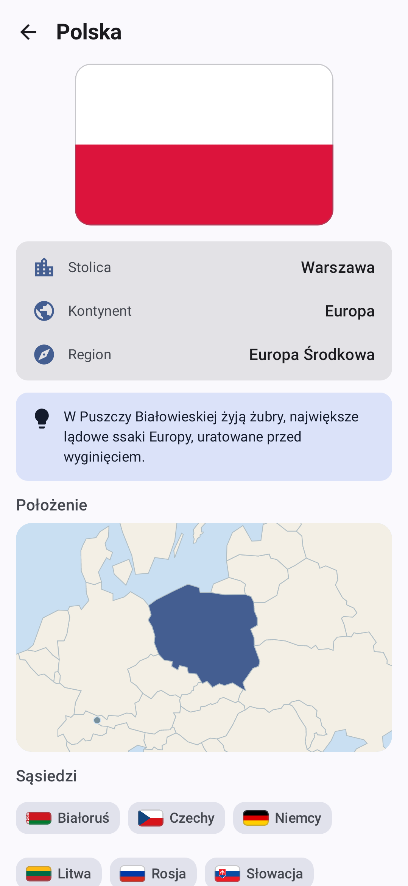

# Poznaj Świat 🌍

Aplikacja na Androida do nauki krajów świata — ich **flag**, **stolic** i **położenia na mapie**. W całości po polsku, działa w pełni offline.

| Ekran główny | Quiz mapy | Oś czasu | Szczegóły kraju |
|---|---|---|---|
|  |  |  |  |

## Funkcje

- **Powtórka dnia (spaced repetition)** — każde pytanie ma termin kolejnej powtórki (1 → 2 → 4 → 7 → 14 → 30 → 60 → 120 dni przy poprawnych odpowiedziach, reset przy błędzie). Codzienna sesja miesza flagi, mapę, stolice i historię naprzemiennie, a licznik serii dni motywuje do regularności.
- **Quiz „Flagi"** — zgadnij, do którego kraju należy pokazana flaga (4 odpowiedzi do wyboru).
- **Quiz „Mapa"** — wskaż podany kraj na interaktywnej mapie świata (przybliżanie, przesuwanie, 3 próby na pytanie; mikropaństwa jako znaczniki).
- **Quiz „Stolice"** — dopasuj stolicę do kraju.
- **Quiz „Historia"** — dopasuj rok do wydarzenia z dziejów świata.
- **Oś czasu** — 90 najważniejszych wydarzeń historii świata (od rewolucji neolitycznej po XXI wiek) podzielonych na epoki, z powiązanymi krajami.
- **Przeglądaj kraje** — lista 197 krajów z wyszukiwarką (ignoruje polskie znaki), filtrem kontynentów, ciekawostką i mini-mapą dla każdego kraju. Ekran kraju pokazuje region (np. „Europa Środkowa"), klikalnych sąsiadów i wydarzenia historyczne związane z krajem — wiedza łączy się w całość.
- **Postępy nauki** — inteligentny dobór pytań (częściej pyta o to, czego jeszcze nie opanowałeś), seria 3 poprawnych odpowiedzi = materiał opanowany; statystyki na ekranie głównym.
- Po każdej odpowiedzi wyświetlana jest **ciekawostka** o kraju lub kontekst wydarzenia.
- Filtr kontynentów obowiązuje w trybach krajowych (Europa, Azja, Afryka, obie Ameryki, Oceania).
- Motyw jasny i ciemny, dynamiczne kolory Material You (Android 12+), ekran powitalny.

## Dane

- 197 krajów (członkowie ONZ + Watykan, Palestyna, Tajwan, Kosowo) z sąsiadami i regionami.
- 90 wydarzeń historycznych po polsku, rozłożonych równomiernie po epokach i kontynentach.
- Nazwy krajów po polsku z zestawu [mledoze/countries](https://github.com/mledoze/countries) (licencja ODbL).
- Flagi z [flagcdn.com](https://flagcdn.com) (domena publiczna).
- Granice państw z [world.geo.json](https://github.com/johan/world.geo.json) (Natural Earth, domena publiczna), wstępnie przetworzone do kompaktowego formatu.
- Polskie nazwy stolic i ciekawostki wygenerowane na potrzeby aplikacji.

Wszystkie dane są wbudowane w aplikację — nie wymaga internetu ani żadnych uprawnień.

## Budowanie

Wymagany JDK 17+ oraz Android SDK (platforma 35).

```bash
./gradlew :app:assembleDebug      # APK debug
./gradlew :app:assembleRelease    # APK release (zminifikowany, ~2 MB)
./gradlew :app:testDebugUnitTest  # testy (Robolectric, ze zrzutami ekranu)
```

APK znajdziesz w `app/build/outputs/apk/`.

## Architektura

- Kotlin + Jetpack Compose (Material 3), jedna aktywność, Navigation Compose.
- Mapa świata rysowana na `Canvas` z własną projekcją i testem trafienia punkt-w-wielokącie — bez zewnętrznych bibliotek map.
- Postępy i harmonogram powtórek (SRS) zapisywane w DataStore (Preferences).
- Test dymny end-to-end na Robolectric przechodzi przez wszystkie główne ekrany i zapisuje zrzuty ekranu do `app/build/screenshots/`.
